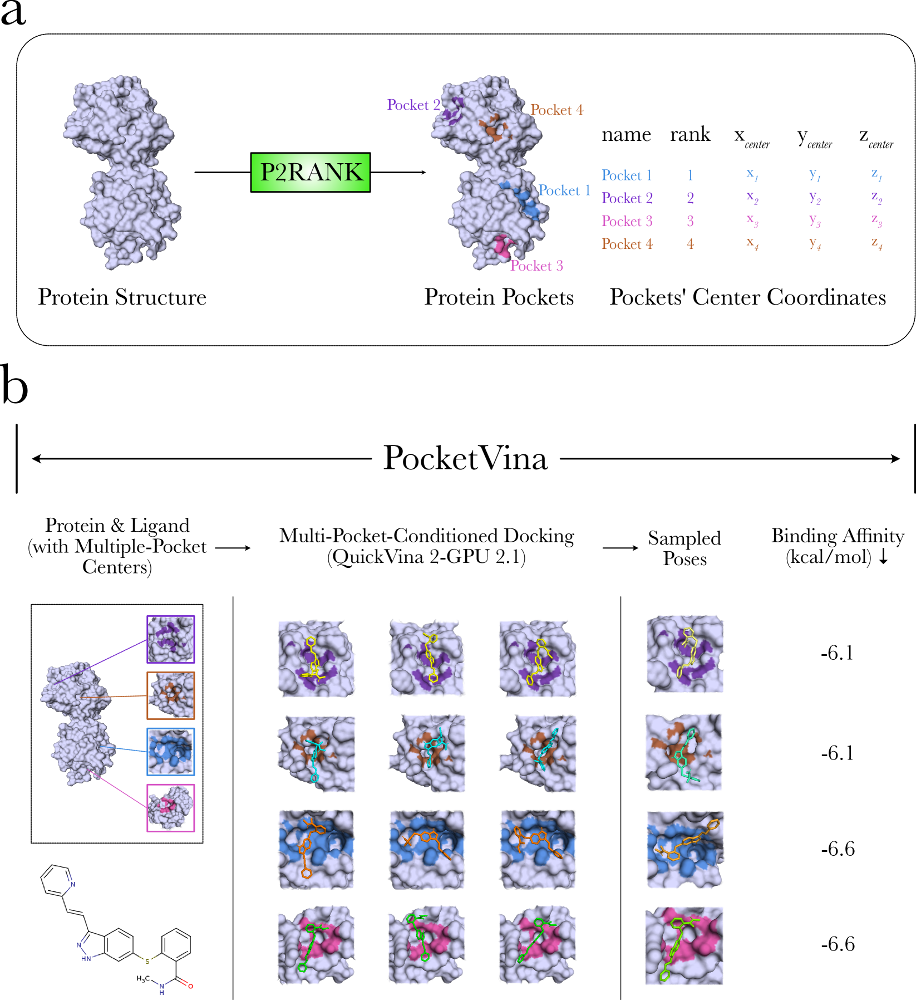

<h1 align="center">PocketVina-GPU</h1>

<p align="center">
  <a href="https://www.arxiv.org/abs/2506.20043"></a>
  <!--<a href="ADD LINK"></a>-->
  <a href="https://isocpp.org/"></a>
  <a href="https://gcc.gnu.org/"></a>
  <a href="https://adoptium.net/"></a>
  <a href="https://www.python.org/downloads/release/"></a>
  <a href="https://developer.nvidia.com/cuda-toolkit"></a>
  <a href="https://www.khronos.org/opencl/"></a>
  <a href="LICENSE"></a>
  <!--<a href="ADD LINK"></a>-->
</p>

<p align="center">
    GPU-accelerated protein-ligand docking with automated pocket detection, exploring through multi-pocket conditioning.
</p>

<p float="center">
  
</p>

## Requirements

- Python 3.6+
- CUDA-capable NVIDIA GPU
- OpenCL 3.0
- Java 17+ (for P2Rank pocket detection)
- CUDA Toolkit (v11.5+)

## Installation

```bash
# Clone the repository and enter
git clone https://github.com/BIMSBbioinfo/PocketVina
cd PocketVina-GPU

# Create & activate Conda env
conda create --name pocketvina python=3.9 -c conda-forge -y
conda activate pocketvina

# Point to Conda libs for OpenCL
export LD_LIBRARY_PATH="$CONDA_PREFIX/lib:$LD_LIBRARY_PATH"

# Install OpenCL runtimes, headers and clinfo
conda install -c conda-forge ocl-icd opencl-headers clinfo -y

# Test OpenCL installation
clinfo

# Then set ICD vendor path
export OCL_ICD_VENDORS="/etc/OpenCL/vendors"

# Build and install PocketVina
pip install build
python -m build
pip install dist/pocketvina_gpu-0.1.0-py3-none-any.whl
```

## Quick Start

```bash
# Start your conda env
conda activate PocketVina
export LD_LIBRARY_PATH=$CONDA_PREFIX/lib/:$LD_LIBRARY_PATH
```

```python
from pocketvina import PocketVinaGPU, PocketVinaConfig, P2RankConfig

# For using direct protein paths with P2Rank
config = PocketVinaConfig(
    protein_paths="example/protein_files.txt",
    smiles_file="example/ligands.txt",  
    output_dir="results",
    batch_size=10,
    p2rank_config=P2RankConfig(         
        threads=4,
        visualizations=False,
        vis_copy_proteins=False,
        output_dir="results"
    )
)

pocketvina = PocketVinaGPU(config, htvs_mode = True)
pocketvina.execute_docking()
```

## Input Files Format

1. `protein_files.txt`: List of protein PDB file paths (one per line)
```bash
/path/to/protein1.pdb      #GIVE ABSOLUTE PATH
/path/to/protein2.pdb      #GIVE ABSOLUTE PATH
```

2. `ligands.txt`: List of SMILES strings (one per line)
```bash
molecule_name,smiles
molecule1,CC1=CC=C(C=C1)C(=O)CCCN1CCC(O)(CC1)c1ccc(Cl)cc1
molecule2,CC(C)(C)NCC(O)c1ccc(O)c(CO)c1
```

## Output Structure


Results are organized in the output directory:

```bash
/PocketVina-GPU/results
├── batch_1/                          # Processed ligand files for batch 1
│   └── converted ligand files (.pdbqt)
│
├── batch_1_out/                      # Docking output files for batch 1
│   ├── docking poses (.pdbqt)        # 3D structures of docked poses
│   └── scores (.json)                # Binding scores and metadata
│
├── proteins/                         # Protein-related files
│   ├── structures/                   # Processed protein files (.pdbqt)
│   └── pockets/                      # Detected binding pockets (.csv)
│
├── configs/                          # Configuration files
│   └── docking parameters for each run
│
├── p2rank_processor.log              # P2Rank run logs
├── pocketvina_summary.log            # PocketVina run logs
│                      
├── combined_results.csv              # Final results in CSV format
└── combined_results.json             # Final results in JSON format
```

## Benchmark Results

All benchmark results and data (TargetDock-AI) are available on Zenodo (https://zenodo.org/records/15733460). To reproduce the published results, navigate into each dataset subfolder under `benchmark`—namely:

- `astex`  
- `dockgen`  
- `pdbbind`  
- `posebuster`

and run:

```bash
python main.py
```

## Citations

If you use PocketVina-GPU in your work, please cite the following paper:

```bibtex
@misc{sarigun2025pocketvinaenablesscalablehighly,
      title={PocketVina Enables Scalable and Highly Accurate Physically Valid Docking through Multi-Pocket Conditioning}, 
      author={Ahmet Sarigun and Bora Uyar and Vedran Franke and Altuna Akalin},
      year={2025},
      eprint={2506.20043},
      archivePrefix={arXiv},
      primaryClass={q-bio.QM},
      url={https://arxiv.org/abs/2506.20043}, 
}
```

and also cite the following papers for P2Rank and Vina families:


### P2Rank
<details>

```bibtex
@article{krivak2018p2rank,
  title   = {P2Rank: machine learning based tool for rapid and accurate prediction of ligand binding sites from protein structure},
  author  = {Krivák, Radoslav and Hoksza, David},
  journal = {Journal of cheminformatics},
  volume  = {10},
  pages   = {1--12},
  year    = {2018},
  publisher = {Springer}
}
```
</details>

### Vina Families
<details>

```bibtex
@article{tang2024vina,
  title   = {Vina-GPU 2.1: towards further optimizing docking speed and precision of AutoDock Vina and its derivatives},
  author  = {Tang, Shidi and Ding, Ji and Zhu, Xiangyu and Wang, Zheng and Zhao, Haitao and Wu, Jiansheng},
  journal = {IEEE/ACM Transactions on Computational Biology and Bioinformatics},
  year    = {2024},
  publisher = {IEEE}
}
```

```bibtex
@article{ding2023vina,
  title   = {Vina-GPU 2.0: further accelerating AutoDock Vina and its derivatives with graphics processing units},
  author  = {Ding, Ji and Tang, Shidi and Mei, Zheming and Wang, Lingyue and Huang, Qinqin and Hu, Haifeng and Ling, Ming and Wu, Jiansheng},
  journal = {Journal of chemical information and modeling},
  volume  = {63},
  number  = {7},
  pages   = {1982--1998},
  year    = {2023},
  publisher = {ACS Publications}
}
```

```bibtex
@article{tang2022accelerating,
  title   = {Accelerating autodock vina with gpus},
  author  = {Tang, Shidi and Chen, Ruiqi and Lin, Mengru and Lin, Qingde and Zhu, Yanxiang and Ding, Ji and Hu, Haifeng and Ling, Ming and Wu, Jiansheng},
  journal = {Molecules},
  volume  = {27},
  number  = {9},
  pages   = {3041},
  year    = {2022},
  publisher = {MDPI}
}
```

```bibtex
@article{trott2010autodock,
  title   = {AutoDock Vina: improving the speed and accuracy of docking with a new scoring function, efficient optimization, and multithreading},
  author  = {Trott, Oleg and Olson, Arthur J},
  journal = {Journal of computational chemistry},
  volume  = {31},
  number  = {2},
  pages   = {455--461},
  year    = {2010},
  publisher = {Wiley Online Library}
}
```
</details>

## License

MIT License

## Support

For issues and questions, please visit:

https://github.com/BIMSBbioinfo/PocketVina/issues

## Acknowledgements

We thank the following projects for their open-sourcing their codes:

- [QuickVina2-GPU-2.1](https://github.com/DeltaGroupNJUPT/Vina-GPU-2.1/tree/main/QuickVina2-GPU-2.1)
- [P2Rank](https://github.com/rdk/p2rank)


