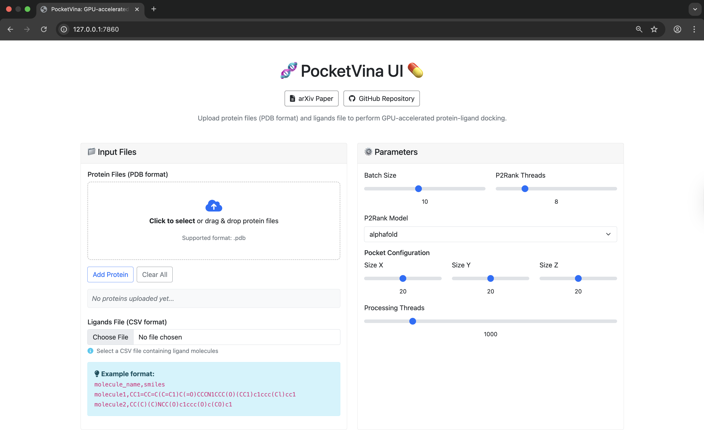

## PocketVina UI App


<p align="center">
  <a href="https://www.youtube.com/watch?v=n8-YKOTvHGs" target="_blank">
    
    <br/>
    <sub>Click the image to watch how to use PocketVina UI on YouTube</sub>
  </a>
  </p>


Run the web UI in two simple ways.

### Option A — Python (no Docker)

After completing installation in the root repo (see [`README.md`](../README.md) → Installation), activate your environment and install UI packages, then run the app from the repo root:

```bash
pip install flask pandas
python3 app/app.py
```

Open: http://127.0.0.1:7860/

### Option B — Docker (GPU)

Build from the repo root and run:

```bash
cd PocketVina
docker build --network=host -t pocketvina:v0.0.1 .
docker run --gpus all -it -p 7860:7860 pocketvina:v0.0.1 bash
python3 app/app.py
```

Or pull the prebuilt image and run:

```bash
docker pull asarigun/pocketvina:v0.0.1
docker run --gpus all -it -p 7860:7860 asarigun/pocketvina:v0.0.1 bash
python3 app/app.py
```

Open: http://127.0.0.1:7860/


